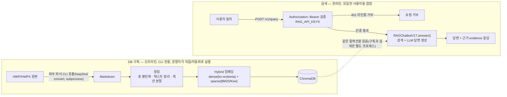

# hierarchical-md-rag

한국 공공기관 입찰공고문(HWP/HWPX/PDF)을 검색·질의응답하는 RAG 파이프라인이다.
**팀 프로젝트(AI_7-team)의 실제 RAG 파이프라인을 포크**해서, HWP/HWPX 문서를
markdown으로 변환하는 파싱 단계만
[`hwp-hierarchical-md-skill`](https://github.com/adover134/korean_official_document_parser_skill)로
교체한 것이다 — 기존의 "HWP→PDF→markdown" 변환 체인을 완전히 대체하며, 그 이전
단계들이 만들던 청킹/검색/답변 생성 로직은 원본 그대로 재사용한다. PDF 원본
문서는 팀의 기존 파이프라인을 그대로 쓴다(새 파서는 HWP/HWPX 전용).

## 구조

- `src/graph/workflow.py` — `RAGChatbotV17`, 질의 분석·검색·답변 생성을 orchestrate
- `src/parsers/` — 청킹(`chunker.py`), 헤더 감지(`auditor.py`), HWP/PDF 로더
- `src/retrievers/` — 벡터스토어(`vectorstore.py`), DB 구축(`build_db.py`), 검색
  휴리스틱(`query_heuristics.py`), 결과 후처리(`result_postprocess.py`)
- `src/evaluation/` — recall/MRR 지표(`metrics.py`), LLM-as-Judge(`llm_judge.py`)
- `scripts/parser_bridge.py` — 새 skill 파서를 팀 파이프라인에 연결하는 통합 지점
  (재매핑 없이 완전 대체 — 상세는 파일 내 docstring 참고)
- `scripts/build_index_new_parser.py` / `scripts/index_pdf_originals.py` — DB 구축
- `scripts/api.py` — 검색(질의응답) API. UI가 실제로 붙는 지점은 이거 하나뿐 —
  DB 구축은 위 스크립트를 서비스 제공자가 직접/자동화로 돌리는 별개 작업(CLI 전용,
  API로 노출하지 않음)
- `scripts/eval_retrieval.py` — E2E 평가(검색 recall + LLM-as-Judge 4축 채점)
- `docs/BUGFIXES.md` / `docs/BUGFIXES_PLAIN.md` — 버그 수정 기록(상세/쉬운 설명)

## 아키텍처

DB 구축(오프라인, CLI 전용)과 검색(온라인, 유일한 사용자용 접점)은 완전히 분리된 두 흐름이다 —
문서를 채워 넣는 일은 서비스 제공자만 하는 운영 작업이고, API는 "LLM을 통한 검색"이라는
사용자용 기능 하나만 가진다.



## DB 구축

```bash
python scripts/build_index_new_parser.py --input <HWP/HWPX_폴더>   # 새 파서 경로
python scripts/index_pdf_originals.py --input <PDF_폴더>            # 팀 원본 경로
```

두 스크립트 다 `data_index/`(gitignore됨)에 동일한 Chroma 컬렉션으로 upsert한다.
임베딩은 로컬 모델(`jhgan/ko-sroberta-multitask`, dense) + BM25(sparse, Kiwi
형태소 분석 기반)를 함께 쓰는 하이브리드 인덱스라 별도 API 키가 필요 없다.

## 답변 생성 LLM 설정

`.env`(gitignore됨)에 아래 값을 채운다:

```bash
HWP_RAG_LLM_BASE_URL=https://api.groq.com/openai/v1   # 또는 http://localhost:11434/v1 (Ollama)
OPENAI_API_KEY=<groq api key 또는 로컬이면 아무 문자열>
REASONING_MODEL=openai/gpt-oss-20b                      # Ollama면 gpt-oss:20b
QUERY_INTENT_MODEL=openai/gpt-oss-20b
```

Groq 무료 한도(일일 200,000 토큰)를 소진하면 로컬 Ollama로 즉시 전환 가능하다
— **반드시 같은 모델(`gpt-oss:20b`)을 써야 결과가 비교 가능하다**(다른 모델,
특히 VLM 계열은 이 파이프라인의 2단계 프롬프트에 안 맞아 결과가 왜곡될 수
있음, `docs/BUGFIXES_PLAIN.md` 참고). 로컬은 응답이 느려서(질문당 1~2분)
타임아웃을 넉넉히 잡아야 한다:

```bash
ollama pull gpt-oss:20b
HWP_RAG_LLM_BASE_URL=http://localhost:11434/v1 OPENAI_API_KEY=ollama-local \
REASONING_MODEL=gpt-oss:20b QUERY_INTENT_MODEL=gpt-oss:20b OPENAI_TIMEOUT_SEC=1200 \
python scripts/eval_retrieval.py --dataset eval_resources/eval_dataset_new8.yaml --judge_model gpt-oss:20b
```

`gpt-oss:20b` 정도 크기의 로컬 reasoning 모델은 검색(retrieval)이 완벽해도
답변 생성 단계에서 실행마다 결과가 달라질 수 있다 — 동일한 컨텍스트에
정답이 명확히 들어있는데도 어떨 때는 정확히 답하고 어떨때는 "확인되지
않습니다"로 놓치는 사례가 확인됐다(`docs/BUGFIXES.md`의 "다른 모델로
m2/m19 교차검증" 참고, 같은 컨텍스트를 OpenAI/Claude로 재현하면 매번
정답). retrieval 관련 회귀를 진단할 때 recall@k가 이미 만점인데 correctness만
낮다면, 먼저 리트리벌 코드가 아니라 이 모델 자체의 편차를 의심할 것.

### 답변 생성 방식: 기본은 순수 LLM

정규식으로 값을 뽑아 템플릿에 끼워넣는 규칙 기반 추출 계층이 원본에 있었지만,
`eval_dataset_new8.yaml`로 직접 비교해본 결과 **LLM이 검색된 컨텍스트만 보고
직접 답변을 생성하는 쪽이 correctness/coverage 모두 더 높게 나왔다**(규칙 기반
템플릿·근거검증 둘 다 자체적으로 취약한 키워드 휴리스틱에 의존하고 있었음 —
자세한 원인은 `docs/BUGFIXES.md` 참고). 그래서 **기본값은 순수 LLM 생성**이다.
규칙 기반 계층은 코드는 그대로 남겨뒀고, 비교/디버깅용으로만 아래처럼 되살릴
수 있다:

```bash
HWP_RAG_ENABLE_LEGACY_EXTRACTIVE=1 python ...
```

### 답변 생성 전략: multi_agent(CoT 분해 + 결정론적 최종 생성 우회)

기본 경로(`two_stage`)는 EVIDENCE_REFINEMENT_PROMPT로 검색 컨텍스트를 LLM이 다시 "관련
근거만 추려서" 압축한 뒤 답을 생성한다. 로컬 gpt-oss:20b에서는 이 압축 단계가 같은
입력·temperature=0.0에서도 실행마다 정답 근거를 놓치는 사례가 실측됐다(`docs/BUGFIXES.md`
"다른 모델로 m2/m19 교차검증" 참고 — Claude/OpenAI로 동일 프롬프트를 재현하면 매번 성공).

`HWP_RAG_ANSWER_STRATEGY=multi_agent`는 AI_7-team `feature/kt2` 브랜치
(`version1/phase2_mvp_report.md`)의 CoT 분해 기법을 이식한 대체 경로다 — 질의를 1~3개
검색 step으로 나누고(`plan_steps`), step마다 이미 확보된 근거로 커버되는지 실제로 갭
체크한 뒤(`_find_step_matches` — kt2 step_router 대응, 갭이 없으면 재검색을 건너뛴다),
갭이 있는 step만 구체적인 검색 쿼리로 재검색하고(`refine_step_query`), step마다 값을
미리 추출해(`extract_step_value`) "이미 확인된 값"으로 명시한 컨텍스트를 구성한다.
**최종 답변 생성(`generate_multi_agent`) 자체도 실행마다 확정된 값을 놓치거나
뒤섞는 비결정성이 실측됐다** — step이 1개뿐이고 값이 이미 확정돼 있으면 이 호출을
아예 생략하고 그 값을 그대로 답으로 쓰며, step이 2개인 숫자 비교 질의(예: "A와 B 중
기초금액이 더 큰 곳은?")도 두 값을 결정론적으로 비교해 템플릿 문장을 만든다(LLM 0회,
`_deterministic_numeric_comparison_answer`) — 값이 이미 확정된 경우 재판단을 최대한
피하는 원칙을 최종 생성 단계까지 넓힌 것이다. 이 경로는 비용 절감이 아니라 기법
자체의 효과 검증이 목적이라 kt2의 에이전트 역할을 생략하지 않는다 — 복합 질의는
기본 경로보다 LLM 호출이 더 늘 수 있다.

최초 이식은 여러 겹의 회귀(검색 파라미터 축소, LLM 쿼리 재작성이 검색 트리거 키워드를
지움, comparison 질의 중복 검색, 대화 이력 중복 삽입, 노이즈 청크가 최종 생성을
방해)를 거쳐 실측으로 하나씩 고쳤다 — 특히 갭 체크에 "그 갭을 메우는 청크를 좁혀
확보"하는 역할까지 통합하는 과정에서 한국어 조사(의/은/는 등)가 검색 트리거 문자열
매칭을 깨는 버그를 발견·수정했다.

이후 신규(미조정) 데이터셋으로 재검증하며 두 번째 겹의 버그가 드러났다: 서로 다른
학교/기관의 거의 동일한 템플릿 문서(예: "...(건축)" vs "...(통신)")가 갭 체크의 토큰
겹침 폴백에서 상위 토큰만으로 서로 오매칭되는 문제, 문서 표기("2027년도")와 질의
표기("2027학년도")가 갈릴 때 갭 체크가 아예 후보를 못 찾는 문제, 예산 비교 숏컷
(`_try_chunk_budget_short_circuit`)이 비교 질의 인식을 못 해 여러 기관을 지목한
질의에서 한 기관만 답하고 끝나는 문제, judge 호출 자체가 Ollama의 기본 컨텍스트
윈도우(4096 토큰)에 걸려 응답이 중간에 잘리는 인프라 문제(judge 프롬프트를 매번
줄여 우회하는 대신 `llm_judge.py`에 영구 수정)까지 실측·수정했다. 전체 과정은
`docs/BUGFIXES.md` "`multi_agent` 경로 구현 및 m2/m19 근본 원인 재해결" 절과 세션
대화 기록 참고.

**검증 결과** — 튜닝된 20문항(`eval_dataset_new20.yaml`)과 신규(미조정) 20문항
(`eval_dataset_new20_v2.yaml`) 양쪽 모두: Correctness **4.65**(두 데이터셋 동일),
문서 Recall@5 1.0000/0.9500, 청크 Recall@5 1.0000/0.9000. 40문항 전체가 Correctness
4.0 이상이거나(숫자값은 정확하고 VAT 표기 등 사소한 누락만 있는 경우 포함) 확인됨.

**알려진 미해결 범위**(위 검증 이후 추가로 만든 복합 질의 2건으로 발견, 이번
40문항에는 없는 형태라 아직 자동 검증 대상이 아님):
- 비교가 아닌 진짜 복합 질의(한 대상에 대해 서로 다른 두 사실을 묻는 경우, 예:
  "낙찰자 결정 기준과 계약기간을 각각 알려주세요")는 각 사실 추출 자체는 맞아도
  더 짧고 덜 유용한 라벨(공식 근거 조항 인용 등)을 고르는 경우가 있다.
- 3곳 이상을 비교하는 질의는 예산(`사업비`) 숏컷 경로에서는 지원되지만(질의가
  명시한 대상 개수를 세어 그만큼 정확히 비교), `_answer_with_multi_agent()` 자체의
  결정론적 비교 우회는 정확히 2-step으로 고정돼 있어 예산이 아닌 3+ 항목 비교는
  아직 `generate_multi_agent()`의 비결정성에 그대로 노출돼 있다.

```bash
HWP_RAG_ANSWER_STRATEGY=multi_agent python ...
```

디버깅에는 `scripts/debug_multiagent_gapcheck.py`를 쓴다 — 문항 하나를 이 경로로
돌리며 gap-check 로그·검색 호출·최종 생성 컨텍스트·답변을
`eval_resources/debug_logs/multiagent_runs/`에 JSON으로 자동 저장한다.

## 검색 API

`RAGChatbotV17.answer()`를 HTTP로 노출하는 질의응답 전용 API(`scripts/api.py`,
FastAPI + `uvicorn`, `langc` conda 환경에 이미 설치돼 있음). DB 구축(위 "DB 구축" 절)과는
완전히 별개다 — 이 API에는 문서 업로드/인덱싱 엔드포인트가 없고, 서비스 사용자용 UI가
붙는 지점이 여기 하나뿐이라는 게 설계 원칙이다.

```bash
python scripts/api.py --port 8001
```

| 변수 | 기본값 | 설명 |
|---|---|---|
| `RAG_API_KEYS` | - | 쉼표로 구분한 허용 API 키 목록. 미설정 시 인증 없이 열린 상태로 동작(로컬 개발용) — 실제 배포 시 반드시 설정할 것 |

인증/요청 검증 배선(실제 챗봇은 목으로 대체 — LLM 호출 없이 즉시 실행됨)은
`tests/test_api.py`로 배포 전에 바로 돌려볼 수 있다:

```bash
pytest tests/test_api.py
```

엔드포인트:
- `GET /v1/health` — DB/챗봇 초기화 상태 점검(인증 불필요)
- `POST /v1/query` — `{"query": "...", "top_k": 24}` -> `RAGChatbotV17.answer()`의 반환 dict
  그대로(`answer`/`evidence`/`confidence`/`retrieved_docs` 등)

```bash
curl -X POST http://localhost:8001/v1/query \
  -H "Authorization: Bearer $RAG_API_KEYS" \
  -H "Content-Type: application/json" \
  -d '{"query": "사업비가 가장 높은 공고는?", "top_k": 10}'
```

rate limit은 아직 없다(hwp-hierarchical-md-service의 rate_limit.py는 Langfuse 트레이스를
근거로 세는데, 이 저장소는 Langfuse를 아직 안 씀 — 필요해지면 추가 검토).

## 평가

```bash
python scripts/eval_retrieval.py --dataset eval_resources/eval_dataset_new8.yaml --judge_model openai/gpt-oss-20b --label <라벨>
python scripts/build_eval_report.py --label <라벨>   # eval_resources/eval_report_<라벨>.html 생성
```

두 단계 다 팀 프로젝트(AI_7-team)와 동일한 방식이다 — `eval_retrieval.py`가
`eval_resources/eval_results_<라벨>.json`을 쓰고, `build_eval_report.py`가 그걸
읽어 HTML 대시보드로 만든다. `build_eval_report.py`는 표준 라이브러리만 써서
(`src/` 비의존) 두 저장소 어디서 돌려도 그대로 동작한다. 결과 JSON/HTML은 둘 다
gitignore됨(`eval_resources/eval_results_*.json`, `eval_resources/eval_report_*.html`).

- `eval_resources/eval_dataset_57docs.yaml`(q1~q8) — 초기 재현 케이스 중심
- `eval_resources/eval_dataset_new8.yaml`(n1~n8) — 문서/기관 겹치지 않는 신규
  세트, 문서 단위+청크 단위(`chunk_uids`) 정답 라벨 포함, 최신 상태에서 8/8 정답
- `--judge_model`은 반드시 지정할 것 — 기본값(`gpt-5-mini`)은 Groq에 없어서
  판정 자체가 실패한다

## 현재 상태

`docs/BUGFIXES.md`에 오늘까지 추적·수정한 근본원인 15개가 전부 기록돼 있다
(검색 순위 오판, org 해석 우선순위, retrieval depth, 답변 생성 방식 전환,
비교 질의 컨텍스트 불균형 등). 두 평가셋 모두 현재 전 문항 정답 상태다.

## 참조

본 프로젝트는 [공공 입찰 데이터 RAG 시스템 개발 프로젝트](https://github.com/Loah-Lee/AI_7-team)에 대해 개선한 버전으로,
HWP(X) 파일 파싱 및 로딩 프로세스 및 검색 과정의 개선을 수행하였다.

기존 프로젝트를 함께 진행한 아래 팀원들에게 감사를 전한다.
@youuuchul (이메일: dbcjf25@gmail.com)
@Loah-Lee (이메일: sims0724@gmail.com)
@wwwwkjh1022-art
@dinu1108

문의는 아래 이메일로
adfsfsf@naver.com
